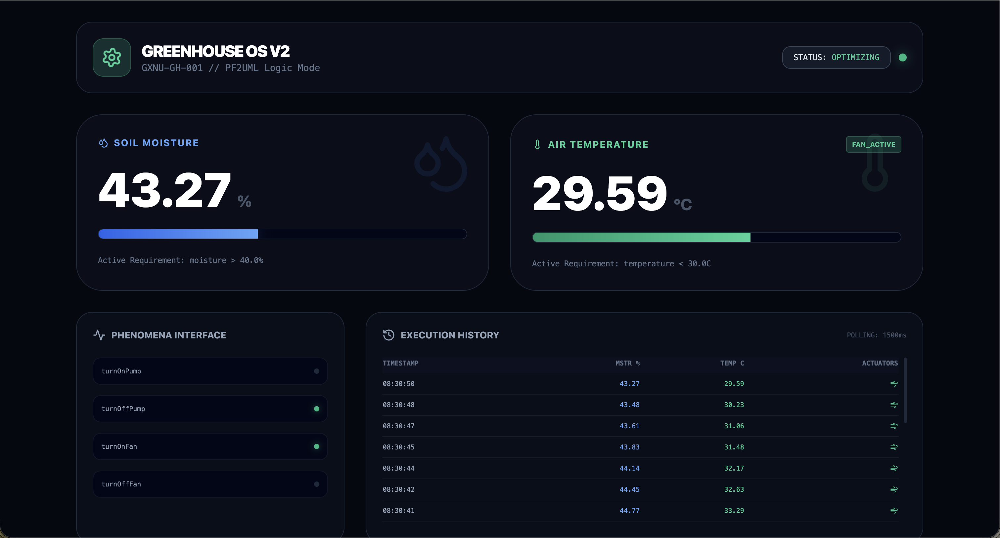
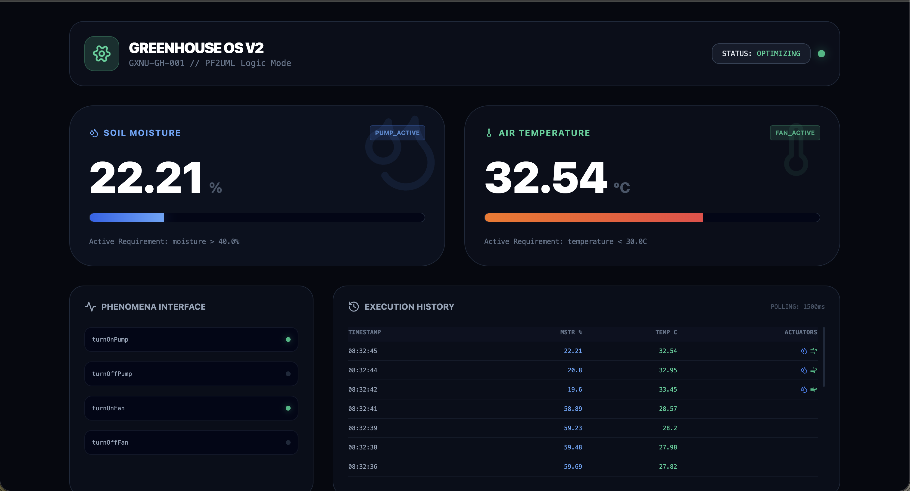
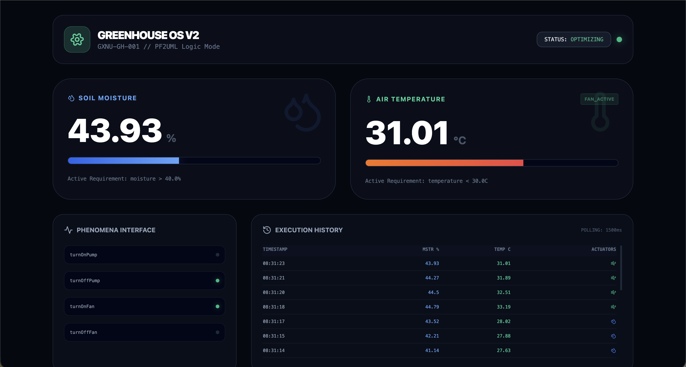

# Smart Greenhouse Controller Implementation

This project is a full-stack IoT simulation developed for the **Requirements Engineering** course. It follows the **Problem Frames Approach**, transforming a PF2UML model into a production-grade containerized application.

## 🏗️ Architecture

The system is built with a modular N-tier architecture:

- **Frontend**: React (Vite) + Tailwind CSS + Lucide Icons. Real-time dashboard with phenomena visualization and execution logs.
- **Backend (Machine Core)**: FastAPI (Async) + Pydantic. Implements the requirement-enforcement logic and causal domain simulation.
- **Database (Persistence)**: MongoDB. Stores historical sensor readings and machine command logs.
- **Orchestration**: Docker Compose for the backend and database.

## 🖼️ System State Demonstrations

| **Normal** | **Pump Active** | **Fan Active** |
| :---: | :---: | :---: |
|  |  |  |
| *Stable operation.* | *Moisture < 40%.* | *Temp > 33°C.* |

## 🚀 Getting Started

### 1. Infrastructure (Backend & DB)
The backend and database are containerized for easy setup.

```bash
cd backend
docker-compose up --build
```
> [!TIP]
> If you get a port conflict on `27017`, it means a local MongoDB is already running. You can change the port mapping in `docker-compose.yml` to `27018:27017`.

### 2. Dashboard (Frontend)
The frontend is run locally to allow for rapid UI development.

1.  **Configure environment**: Create or edit `frontend/.env` to point to your backend:
    ```env
    VITE_API_URL=http://localhost:8002
    ```
2.  **Launch**:
    ```bash
    cd frontend
    npm install
    npm start
    ```

## 🧪 Running Tests

### Backend Tests (Pytest)
Ensure you have the dependencies installed, then run:
```bash
cd backend
pytest tests/
```

### Frontend Tests (Vitest)
Run the React component tests:
```bash
cd frontend
npm test
```

## 🛠️ Project Structure
```text
implementation/
├── backend/
│   ├── app/
│   │   ├── api/        # Shared Phenomena (Endpoints)
│   │   ├── core/       # Machine Logic & Simulation
│   │   ├── schemas/    # Pydantic Data Models
│   │   └── main.py     # Application Entry
│   ├── run.py          # Launcher
│   └── Dockerfile
├── frontend/
│   ├── src/
│   │   ├── App.jsx     # Dashboard Logic
│   │   └── index.css   # Tailwind Styles
│   └── tailwind.config.js
└── docker-compose.yml
```

## 📜 Requirements Logic
The **Greenhouse Controller Machine** enforces two primary requirements:
1. **Moisture Maintenance**: If Soil Moisture < 40%, trigger `turnOnPump`.
2. **Temperature Regulation**: If Air Temperature > 30°C, trigger `turnOnFan`.
3. **Safety Timer**: If Pump runs > 15 mins (900s), trigger `turnOffPump` to prevent overheating.

---
*Developed for GXNU Requirements Engineering 2026*
